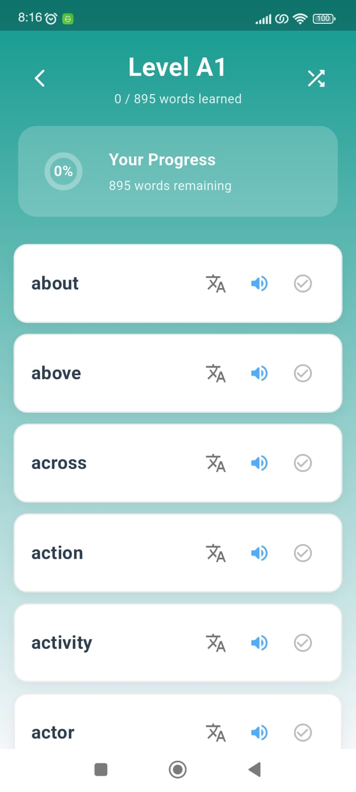
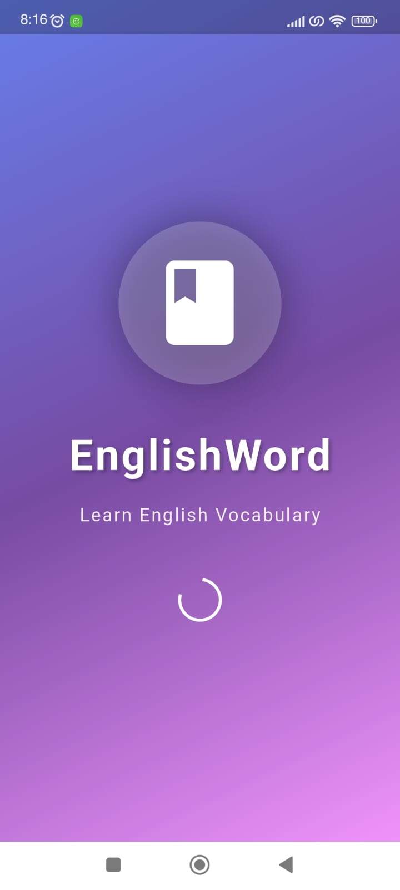
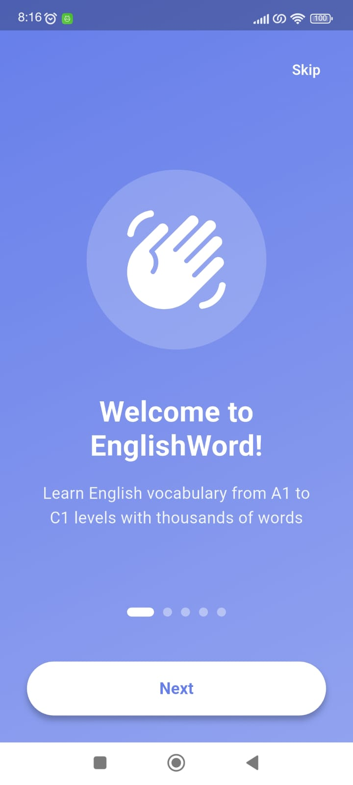
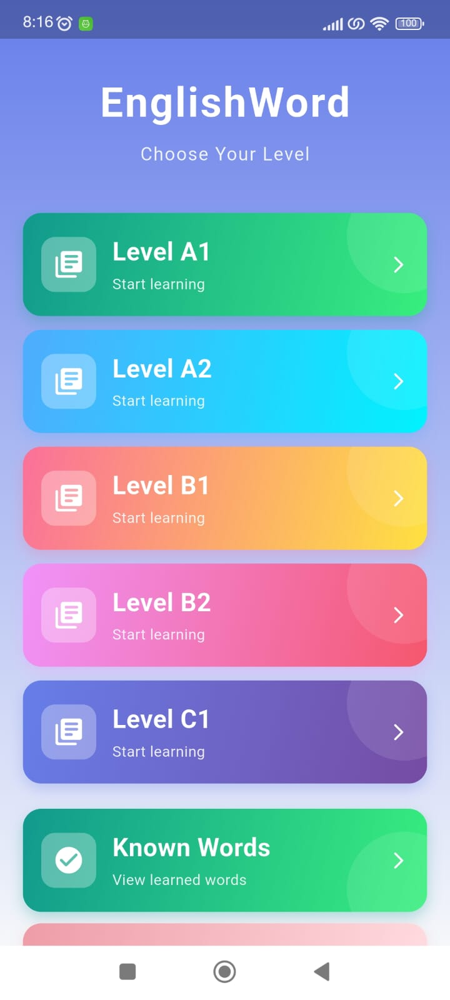
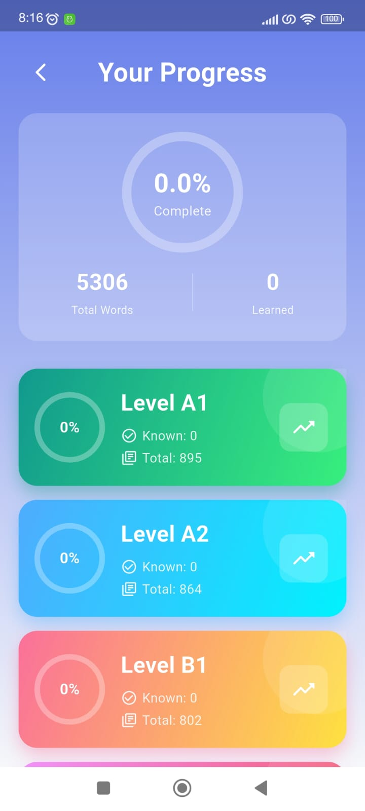
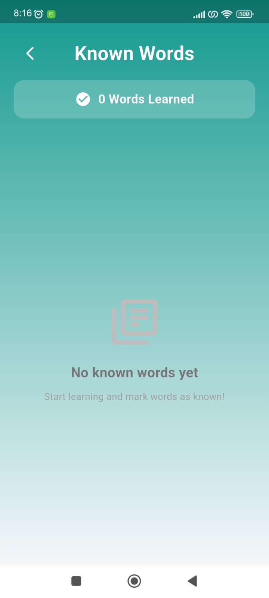

# EnglishWord 📚

A modern Flutter application for learning English vocabulary from A1 to C1 levels.

## 📸 Screenshots

  
  
  
  
  
  

## ✨ Features

- 📖 **5 Levels**: A1, A2, B1, B2, C1 vocabulary lists
- ✅ **Track Progress**: Mark words you know and watch them move to your Known Words list
- 📊 **Statistics**: View your learning progress for each level
- 🔊 **Text-to-Speech**: Listen to correct pronunciation
- 🎲 **Shuffle Mode**: Practice words in random order
- 🎯 **Onboarding**: First-time user guide
- 💾 **Auto-Save**: Your progress is saved automatically

## 📥 Download

[Download APK](assets/app-release.apk)

## 🛠️ Built With

- [Flutter](https://flutter.dev/)
- [flutter_tts](https://pub.dev/packages/flutter_tts) - Text-to-speech
- [shared_preferences](https://pub.dev/packages/shared_preferences) - Local storage

## 👥 Contributors

- **Developer**: [@emrecan-nt](https://github.com/emrecan-nt)
- **Support**: [@meryemkiremitci](https://github.com/meryemkiremitci)

